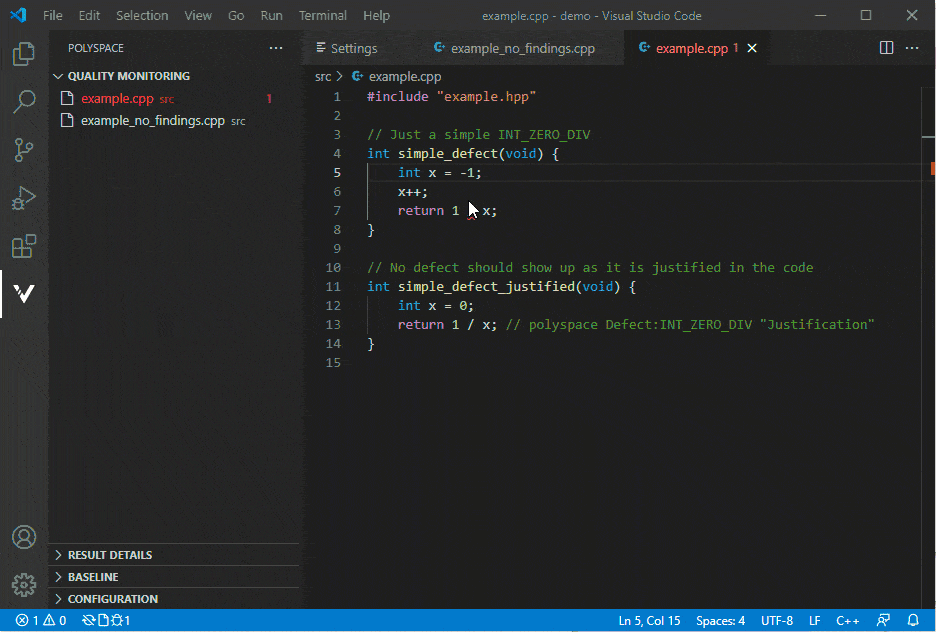
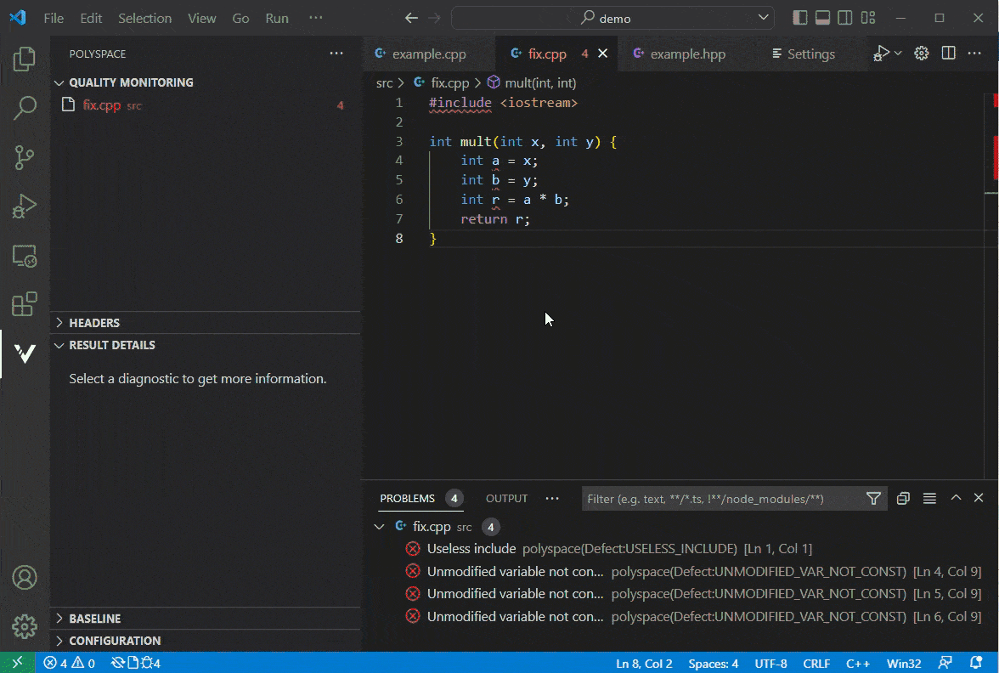
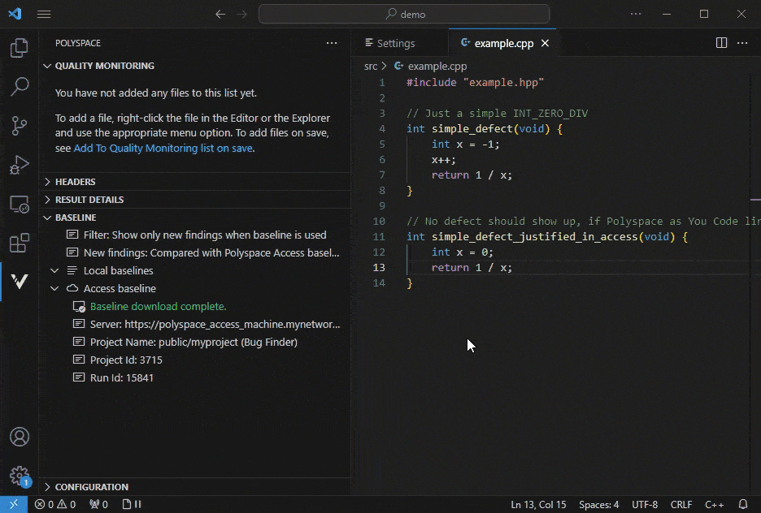

# Polyspace as You Code

Polyspace as You Code detects critical defects and security vulnerabilities and checks for code compliance with coding rule standards such as MISRA C®, MISRA C++, AUTOSAR C++14, CERT® C, CERT C++, as well as custom naming conventions, and reports the findings within the source code view. When connected to the Polyspace Access central repository, it can highlight only new issues added by the developer compared to the development baseline.

## Installation

Polyspace as You Code requires a Polyspace Access license. if you do not have a license, you can **[request a free trial](https://www.mathworks.com/campaigns/products/trials.html?prodcode=AB)**.

To run the extension, download and run the Polyspace as You Code installer for your platform:
- [For Windows](https://www.mathworks.com/PaYC_Installer_24b_win64)
- [For Linux](https://www.mathworks.com/PaYC_Installer_24b_glnx64)
- [For Mac (intel)](https://www.mathworks.com/PaYC_Installer_24b_maci64)

The extension is also available on the [Visual Studio Code Marketplace](https://marketplace.visualstudio.com/items?itemName=MathWorks.polyspace). If you download the extension from the Marketplace, you still need to run the Polyspace as You Code installer to install the Polyspace analysis engine before you can start using the extension.

After the installation, you might need to configure some extension settings to make full use of all the Polyspace as You Code features. For more information, see the [Get Started](#get-started) section.

## Get Started

To start using Polyspace as You Code with the default configuration:
1. Open the settings ( **Ctrl**+**,** ) and configure the `polyspace.analysisengine` settings:
   * **Polyspace Installation Folder**: Path to your Polyspace as You Code installation. For instance:
      - **Windows**: `C:\Program Files\Polyspace as You Code\R2024b`
      - **Linux**: `/usr/local/PolyspaceAsYouCode/R2024b`
   * **Result Folder**: Path to folder where results, baselines and other temporary files are stored.
2. Open a folder or workspace using the **File** menu, and then open a file from the **EXPLORER** pane.
3. Make some changes to the file and save. The file is added to the Quality Monitoring view and the analysis starts.
4. Open the Polyspace views from the Activity Bar to see the status of the analyzed file in the Quality Monitoring view.
5. Review findings in the **PROBLEMS** pane or directly in your source code.

Depending on your build system, you might need to modify the `polyspace.analysisOptions` settings before running an analysis. See the **[Polyspace as You Code Documentation](https://www.mathworks.com/help/releases/R2024b/bugfinder/polyspace-as-you-code-in-visual-studio-code.html)**.

### More information to get started

To see a more detailed description of how to get started with Polyspace as You Code, open the **Polyspace as You Code walkthroughs**. To open the walkthroughs, go to Help > Welcome > Walkthroughs.

## Configuration

### Configure the Analysis

* **Configure the Build** of your files either manually or automatically.
* **Automatically monitor** the quality of all modified files.
* **Analyze files on save** or manually launch Polyspace analysis.
* **Configure checkers** by selecting defects and standards.
* **Analyze headers** as source files.

### Review Results

* **Understand a Polyspace finding** with contextual help.
* **Automatically fix findings** or add comments to justify them.
* **Provide a catalog** of allowed justifications.
* **View findings in headers** on demand.

### Baseline

* **Work with a local baseline** to only show findings in the code you changed.
* **Connect to Polyspace Access** to use a Polyspace Bug Finder result as a baseline.

## Troubleshooting

If an analysis fails, you see a popup with a short description of the issue.
To investigate the issue further, open the Output panel by selecting the file where the analysis failed from the Quality Monitoring view, or by clicking in the Configuration or Baseline views. Scroll through the Output panel to try to determine the cause of the analysis failure.

## Contact Us

We encourage all feedback. If you encounter a technical issue or have an enhancement request, create an issue here or contact MathWorks at support@mathworks.com.

-----------------------------------------------------------------------------------------------------------
